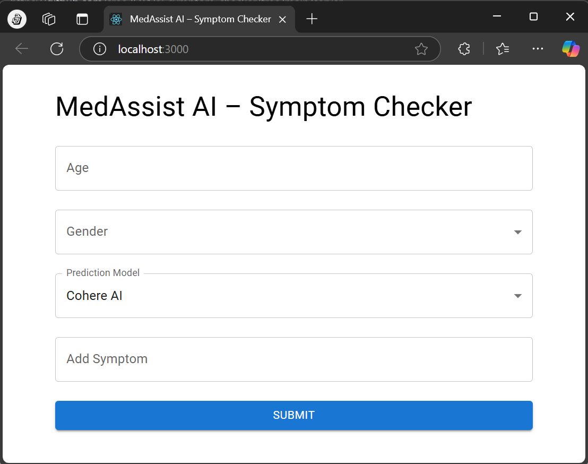

# 🩺 MedAssist AI – Symptom Checker (Frontend)

This is the **React frontend** for the MedAssist AI project — a full-stack AI-powered healthcare assistant that helps users check symptoms and get suggestions using **AI (Cohere)** and **ML models**.

## 🌐 Live Demo

👉 [View App on Vercel](https://ai-symptom-checker-delta.vercel.app/)

---

## 🚀 Features

- Input age, gender, and multiple symptoms
- Choose between AI (Cohere) or ML (Random Forest) model
- Clean UI with Material-UI components
- Real-time results shown directly from backend predictions

---

## 📁 Folder Structure

```
client/
├── public/
│   └── index.html
├── src/
│   ├── components/
│   │   └── SymptomForm.jsx
│   └── App.jsx
├── package.json
└── README.md
```

---

## 🧰 Tech Stack

- **React.js**
- **Material-UI**
- **Axios**
- **JavaScript (ES6)**

---

## ⚙️ Getting Started

### Prerequisites

- Node.js >= 14.x
- npm or yarn

### Install Dependencies

```bash
cd client
npm install
```

### Start Development Server

```bash
npm start
```

The app will run on [http://localhost:3000](http://localhost:3000)

---

## 🔗 API Endpoints

Ensure your FastAPI backend is running at `http://localhost:8000`.

| Endpoint | Purpose |
|----------|---------|
| `/api/check-symptoms` | Uses Cohere AI to return suggestions |
| `/api/predict-disease` | Uses traditional ML model to predict disease |

---

## 🖼️ Screenshots




---

## 📌 TODOs

- [ ] Improve symptom input with autocomplete
- [ ] Add chatbot interface
- [ ] Mobile responsive tweaks

---

## 🧑‍💻 Author

Developed by [Sreekanth]  
<!-- 🔗 [LinkedIn](https://www.linkedin.com/in/sreekanth-j-developer/) | [Portfolio](https://myportfolio-dusky-seven.vercel.app/) -->

---

## 📄 License

This project is licensed under the MIT License.
```

---
